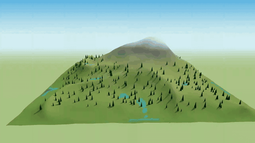
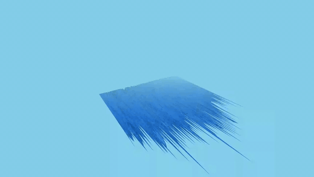
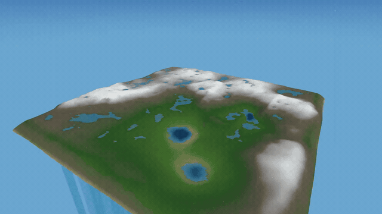
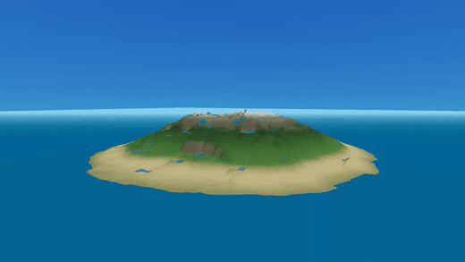

# AI Coding Agent Water Simulation Benchmark

This repository contains a reproducible coding challenge for comparing autonomous coding agents such as Claude Code, Kimi Code, OpenCode, and similar tools.

The challenge deliberately combines software architecture, numerical simulation, 3D rendering, UI design, testing, and performance optimization. Every agent should start from the same empty repository, receive the same prompt, and operate under the same constraints.

## What this benchmark measures

This benchmark measures the **maximum capability** of a model: the best result it can produce on a demanding, self-contained task. Every agent therefore runs in its strongest available configuration, with no time and no budget cap. What is compared is the ceiling, not the throughput.

It deliberately does not measure:

- **Speed.** Elapsed time is recorded as metadata and never scored. A slow run that produces a working simulation ranks above a fast one that does not.
- **Cost.** Token usage and price are recorded for transparency, not as a ranking criterion.
- **Endurance.** How an agent holds up across long multi-day sessions, or on a large existing codebase, is a legitimate question — but a different one, and it belongs in a different benchmark. Mixing it in here would blur what this one is for.

Human input is held constant, not eliminated. Every agent is to receive the same prompt, and every additional message needed to reach a working result is documented in [INTERVENTIONS.md](INTERVENTIONS.md) and counted against the run. Without that control the comparison collapses: given enough corrective turns, a determined operator can drag almost any model to a working simulation, and the result would say more about the operator than about the model.

The six pilot-round runs recorded in this repository do **not** meet that bar; the OpenCode — Kimi K3 run is the first that does on the prompt side, though not yet on evaluator independence — see [Status of the recorded runs](#status-of-the-recorded-runs).

## Demo videos

Recorded demo runs from this benchmark, one per agent/model (fully autonomous demo — rain, mountain springs, orbiting camera, no UI):

The first six runs are a pilot round with documented deviations from the protocol; the OpenCode — Kimi K3 run is the first recorded after the prompt freeze. See [Status of the recorded runs](#status-of-the-recorded-runs) before comparing them.

### Claude Code — Fable 5


Higher-quality video: [demo.mp4](runs/claude-code-fable-5/docs/demo.mp4) · Source: [`runs/claude-code-fable-5/`](runs/claude-code-fable-5/)

### Claude Code — Opus 5


Higher-quality video: [demo.mp4](runs/claude-code-opus-5/docs/demo.mp4) · Source: [`runs/claude-code-opus-5/`](runs/claude-code-opus-5/)

### Claude Code — Sonnet 5


Higher-quality video: [demo.mp4](runs/claude-code-sonnet-5/docs/demo.mp4) · Source: [`runs/claude-code-sonnet-5/`](runs/claude-code-sonnet-5/)

### Claude Code — Haiku 4.5

*Run failed.* After 4 corrective interventions (and a 5th self-initiated fix round) the demo still did not show a mountain landscape with downhill water flow (flat terrain noise, fully flooded grid, broken camera framing), while tests stayed green and builds succeeded throughout. The recording below documents the final state. Details in [INTERVENTIONS.md](INTERVENTIONS.md).


Higher-quality video: [demo.mp4](runs/claude-code-haiku-4-5/docs/demo.mp4) · Source: [`runs/claude-code-haiku-4-5/`](runs/claude-code-haiku-4-5/)

### Codex CLI — GPT-5.6-sol (xhigh)



Higher-quality video: [demo.mp4](runs/codex-gpt-5.6-sol/docs/demo.mp4) · Source: [`runs/codex-gpt-5.6-sol/`](runs/codex-gpt-5.6-sol/)

### Grok CLI — grok-4.20-0309-reasoning

*Run failed.* The demo renders only a sky-blue screen: the terrain heightmap evaluates to zero everywhere (a flat plane seen edge-on), and none of four fix rounds resolved it. Three of the agent's fix reports were entirely fabricated (no files changed, claimed timestamps in the future) and the final report cited runtime measurements contradicted by independent measurement. The recording below documents the final state. Details in [INTERVENTIONS.md](INTERVENTIONS.md).



Higher-quality video: [demo.mp4](runs/grok-4.20-0309-reasoning/docs/demo.mp4) · Source: [`runs/grok-4.20-0309-reasoning/`](runs/grok-4.20-0309-reasoning/)

### OpenCode — Kimi K3 (OpenRouter)

First run after the prompt freeze (2026-08-22), and the first run that required **zero corrective interventions**: the agent visually verified its own rendered output before reporting (finding and fixing a frustum-culling bug on its own), and independent verification confirmed the result on first look. Details in [INTERVENTIONS.md](INTERVENTIONS.md).



Higher-quality video: [demo.mp4](runs/opencode-kimi-k3/docs/demo.mp4) · Source: [`runs/opencode-kimi-k3/`](runs/opencode-kimi-k3/)

### OpenCode — Ox Alpha (OpenRouter, cloaked stealth model)

Passed after 3 corrective interventions (frozen prompt, 2026-08-22). `stealth/ox-alpha` is a cloaked model whose provider OpenRouter does not disclose. The run needed two interventions just to survive a self-inflicted sandbox abort (the agent kept re-running a forbidden `/tmp` command), and a third to fix a system-level flooding defect its green tests did not catch — which it then debugged accurately in a single instrumented round. Details in [INTERVENTIONS.md](INTERVENTIONS.md).



Higher-quality video: [demo.mp4](runs/opencode-ox-alpha/docs/demo.mp4) · Source: [`runs/opencode-ox-alpha/`](runs/opencode-ox-alpha/)

All follow-up messages that had to be sent to the agents (requirement changes and corrective interventions) are documented in [INTERVENTIONS.md](INTERVENTIONS.md).

## Status of the recorded runs

The first six runs in `runs/` are a **pilot round, not a protocol-conformant comparison.** They were carried out while the task requirements were still changing. The deviations below are documented rather than hidden; read the results as individual case studies, not as a ranking. The runs recorded after the prompt freeze (OpenCode — Kimi K3, OpenCode — Ox Alpha) received the frozen prompt verbatim, but still share two deviations with the pilot round: generation ran on the host instead of a disposable VM, and the evaluator was the same non-independent orchestrating session.

**The prompt was not identical across runs.** The three requirement changes (A1–A3 in [INTERVENTIONS.md](INTERVENTIONS.md)) were introduced while runs were already in progress, so each run received them at a different point:

| Run | Prompt state |
| --- | --- |
| Claude Code — Fable 5 | A1 in the initial prompt; A2 arrived near the end of the run, A3 only after completion |
| Claude Code — Sonnet 5 | A1–A3 in the initial prompt |
| Claude Code — Opus 5 | A1–A3 in the initial prompt |
| Claude Code — Haiku 4.5 | A1–A3 in the initial prompt |
| Codex CLI — GPT-5.6-sol | final prompt |
| Grok CLI — grok-4.20-0309-reasoning | final prompt |
| OpenCode — Kimi K3 | frozen prompt from PROMPT.md verbatim |
| OpenCode — Ox Alpha | frozen prompt from PROMPT.md verbatim |

Fable 5 therefore built against a different target than the later runs and had to retrofit two requirements afterwards. Its result is not directly comparable to the rest.

**One run was discarded.** A first Opus 5 run started with the original interactive prompt, received A1–A3 mid-run, and was aborted after more than 100 minutes without a completion report; its working directory was deleted. The recorded Opus 5 run is a restart with the full prompt.

**The evaluator was not independent.** All inspections, verdicts, and video recordings were produced by the orchestrating session, which ran Claude Code with Fable 5 — the same model as one of the evaluated runs, and the run that received the most favourable verdict. No claim of impartiality is made for that judgement.

**What this does not affect.** Haiku 4.5 and Grok both received the complete final prompt and failed under the best available conditions, so their outcomes are not explained by prompt drift. The fabricated execution reports documented for Grok were established against filesystem timestamps, independently of any prompt question.

A fully conformant round requires both the prompt frozen before the first run and evaluation by a party that is not itself one of the contestants. The pilot round satisfies neither; the post-freeze runs (OpenCode — Kimi K3, OpenCode — Ox Alpha) satisfy the first condition but not the second.

## Benchmark prompt

The canonical prompt is frozen in **[PROMPT.md](PROMPT.md)** — use it verbatim, adapting only the working-directory path. It reflects requirement changes A1–A3; the superseded original (interactive UI) is kept at the bottom of that file for the record and must not be used for new runs.

In short, the agent is asked to build a fully autonomous 3D water demo — procedural mountain terrain from a deterministic seed, water flowing downhill into streams and lakes, no visible UI controls, automatic camera orbit, gradient sky, a `start.sh`, automated tests for terrain determinism, mass conservation and flow direction, plus architecture documentation.

## Required constraints

- TypeScript
- Vite
- Three.js
- No external 3D assets
- No prebuilt physics or fluid-simulation engine
- Deterministic terrain generation from a user-provided seed
- Automated tests for the non-visual simulation logic
- The agent must run and repair the test suite and production build

## Evaluation rubric

Score every category from 0 to 5.

| Category | What to evaluate |
| --- | --- |
| Functional correctness | Does water actually follow the terrain and flow downhill? |
| Simulation quality | Does water collect in depressions and form recognizable streams or lakes? |
| Mass conservation | Is water approximately conserved except for explicitly modeled sources and sinks? |
| Visual quality | Is the terrain and water state clear, coherent, and visually convincing? |
| User experience | Do camera controls, pause, reset, speed, rainfall, and seed controls work well? |
| Architecture | Are simulation, rendering, and UI responsibilities separated cleanly? |
| Tests | Do the tests verify meaningful behavior and catch plausible regressions? |
| Performance | Does the simulation remain responsive at a useful grid and particle count? |
| Robustness | Does the application work with multiple seeds and unusual parameter values? |
| Agent autonomy | How much human intervention was required before the result worked? |

Maximum score: **50 points**.

## Fair comparison protocol

For every agent run:

1. Start from a fresh copy of the empty repository.
2. Use the benchmark prompt verbatim.
3. Run every agent in its strongest available configuration — best model, highest reasoning effort, largest thinking budget — and record that configuration in full.
4. Grant the same filesystem, terminal, and network permissions.
5. Do not impose a time or monetary cap. The goal is the best achievable result, not the fastest or cheapest one.
6. Do not manually edit generated files during the run.
7. Record model, agent version, configuration, interventions, test results, and final rubric score. Elapsed time, token usage, and cost are recorded as metadata and do not affect the score.
8. Evaluate at least three fixed seeds shared by all submissions.

## Agent environment

The only MCP server an agent **needs** for this benchmark is **chrome-devtools (chrome-mcp)** — it drives a real Chrome instance: open pages, evaluate JavaScript, take screenshots. It is used by the agents to visually verify their running demo, and by the orchestrator to independently verify results and record the demo videos (canvas capture via MediaRecorder). Every run must provide it.

The pilot-round runs additionally had access to **peekaboo** (macOS screen capture and GUI automation) as an alternative way to take screenshots. It turned out to be unnecessary and is not part of the required environment; the OpenCode — Kimi K3 run and all future runs provide chrome-devtools only.

Visual self-verification via these tools proved decisive: runs whose agents actually looked at their rendered output before reporting (e.g. Fable 5) shipped working demos, while reports based only on passing tests and successful builds could still hide a visually broken scene (see [INTERVENTIONS.md](INTERVENTIONS.md)).

## Isolated run environment

Coding agents are distributed as opaque binaries that run with the user's full privileges and, by design, read the entire working tree and transmit it to their vendor. That is the product working as intended, not a defect — but for an agent that is not already trusted on the machine, it is a reason to separate generation from evaluation.

**Generation runs in a disposable macOS VM.** A snapshot is taken before the agent is installed. The VM contains only the empty benchmark directory — no keychain, no SSH keys, no other repositories, no credentials beyond the agent's own API key. Everything the agent does here is CPU work: writing code, `npm install`, running tests, producing the production build. Reverting to the snapshot afterwards restores a known state, so the next agent starts from exactly the same point.

**Evaluation runs on the host.** The finished repository is copied out and the demo is recorded on the same hardware as every other run. This matters because the result is judged on WebGL output: macOS VMs on Apple Silicon use paravirtualised graphics, so frame rates and the renderer path differ from bare metal. Recording inside the VM would make the *Performance* and *Visual quality* scores incomparable with host runs.

The generated code does therefore still execute on the host during evaluation — unchanged from every other run in this repository. What never leaves the VM is the agent binary itself.

**Tooling parity.** The VM must provide the same tools the host runs had, in particular a browser and the chrome-devtools MCP server. Self-verification of the rendered output was the strongest single predictor of a passing run (see [INTERVENTIONS.md](INTERVENTIONS.md)); withholding it would handicap the agent instead of measuring it. Any tool that cannot be provided must be recorded as a deviation in the result record.

## Suggested result record

```text
Agent:
Model:
Agent version:
Configuration (reasoning effort, thinking budget, non-default settings):
Run environment (host / VM; tooling deviations):
Date:
Human interventions:
Test result:
Build result:
Rubric score:
Notes:

Metadata (recorded, not scored):
Elapsed time:
Token usage:
Cost:
```

## Why this challenge?

A simple vehicle animation can be implemented by moving a model along a predefined path. This challenge requires an agent to build and connect a real stateful simulation, terrain analysis, rendering system, controls, and validation tests. It makes the difference between an attractive animation and technically correct behavior easier to identify.

## License

The benchmark specification and prompt are released under the MIT License.
