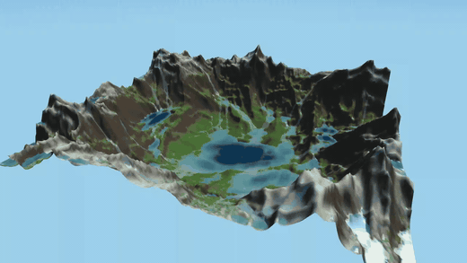
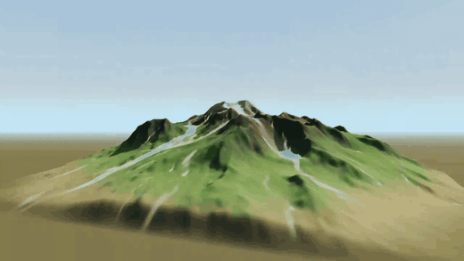
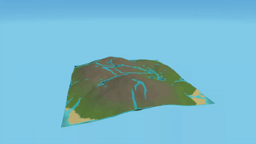
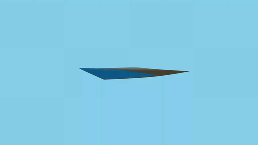

# AI Coding Agent Water Simulation Benchmark

This repository contains a reproducible coding challenge for comparing autonomous coding agents such as Claude Code, Kimi Code, OpenCode, and similar tools.

The challenge deliberately combines software architecture, numerical simulation, 3D rendering, UI design, testing, and performance optimization. Every agent should start from the same empty repository, receive the same prompt, and operate under the same constraints.

## Demo videos

Recorded demo runs from this benchmark, one per agent/model (fully autonomous demo — rain, mountain springs, orbiting camera, no UI):

### Claude Code — Fable 5



Higher-quality video: [demo.mp4](runs/claude-code-fable-5/docs/demo.mp4) · Source: [`runs/claude-code-fable-5/`](runs/claude-code-fable-5/)

### Claude Code — Opus 5



Higher-quality video: [demo.mp4](runs/claude-code-opus-5/docs/demo.mp4) · Source: [`runs/claude-code-opus-5/`](runs/claude-code-opus-5/)

### Claude Code — Sonnet 5



Higher-quality video: [demo.mp4](runs/claude-code-sonnet-5/docs/demo.mp4) · Source: [`runs/claude-code-sonnet-5/`](runs/claude-code-sonnet-5/)

### Claude Code — Haiku 4.5

*Run failed.* After 4 corrective interventions (and a 5th self-initiated fix round) the demo still did not show a mountain landscape with downhill water flow (flat terrain noise, fully flooded grid, broken camera framing), while tests stayed green and builds succeeded throughout. The recording below documents the final state. Details in [INTERVENTIONS.md](INTERVENTIONS.md).



Higher-quality video: [demo.mp4](runs/claude-code-haiku-4-5/docs/demo.mp4) · Source: [`runs/claude-code-haiku-4-5/`](runs/claude-code-haiku-4-5/)

All follow-up messages that had to be sent to the agents (requirement changes and corrective interventions) are documented in [INTERVENTIONS.md](INTERVENTIONS.md).

## Benchmark prompt

Copy the following prompt into the coding agent being evaluated:

> Build an interactive 3D water simulation in this empty repository.
>
> Generate a procedural mountain landscape from a deterministic seed. The user must be able to enable rainfall or place a water source by clicking on the terrain. Water must flow downhill according to the local terrain gradient, collect in depressions, and form visible streams and lakes.
>
> Use TypeScript, Vite, and Three.js. Implement camera controls, start/pause, reset, simulation-speed control, rainfall-intensity control, and seed selection. Do not use a prebuilt physics engine or external 3D assets.
>
> Keep the simulation, rendering, and user-interface code cleanly separated. Add meaningful automated tests for deterministic terrain generation, approximate conservation of water mass, and downhill flow direction.
>
> Install the required dependencies, run the tests and production build, and independently fix any errors you encounter. Finally, document the architecture, the simulation model, how to run the application, and all known limitations in the README.

## Required constraints

- TypeScript
- Vite
- Three.js
- No external 3D assets
- No prebuilt physics or fluid-simulation engine
- Deterministic terrain generation from a user-provided seed
- Automated tests for the non-visual simulation logic
- The agent must run and repair the test suite and production build

## Evaluation rubric

Score every category from 0 to 5.

| Category | What to evaluate |
| --- | --- |
| Functional correctness | Does water actually follow the terrain and flow downhill? |
| Simulation quality | Does water collect in depressions and form recognizable streams or lakes? |
| Mass conservation | Is water approximately conserved except for explicitly modeled sources and sinks? |
| Visual quality | Is the terrain and water state clear, coherent, and visually convincing? |
| User experience | Do camera controls, pause, reset, speed, rainfall, and seed controls work well? |
| Architecture | Are simulation, rendering, and UI responsibilities separated cleanly? |
| Tests | Do the tests verify meaningful behavior and catch plausible regressions? |
| Performance | Does the simulation remain responsive at a useful grid and particle count? |
| Robustness | Does the application work with multiple seeds and unusual parameter values? |
| Agent autonomy | How much human intervention was required before the result worked? |

Maximum score: **50 points**.

## Fair comparison protocol

For every agent run:

1. Start from a fresh copy of the empty repository.
2. Use the benchmark prompt verbatim.
3. Use the agent's default recommended model and settings, or record every deviation.
4. Grant the same filesystem, terminal, and network permissions.
5. Apply the same time or monetary budget.
6. Do not manually edit generated files during the run.
7. Record elapsed time, model, agent version, token usage, cost, interventions, test results, and final rubric score.
8. Evaluate at least three fixed seeds shared by all submissions.

## Agent environment

All recorded runs in `runs/` were executed with Claude Code sub-agents that, in addition to the usual filesystem/terminal tools, had access to the following MCP servers:

- **chrome-devtools (chrome-mcp)** — drives a real Chrome instance: open pages, evaluate JavaScript, take screenshots. Used by the agents to visually verify their running demo, and by the orchestrator to independently verify results and record the demo videos (canvas capture via MediaRecorder).
- **peekaboo** — macOS screen capture and GUI automation, available as an alternative way to take screenshots of the running application.

Visual self-verification via these tools proved decisive: runs whose agents actually looked at their rendered output before reporting (e.g. Fable 5) shipped working demos, while reports based only on passing tests and successful builds could still hide a visually broken scene (see [INTERVENTIONS.md](INTERVENTIONS.md)).

## Suggested result record

```text
Agent:
Model:
Agent version:
Date:
Time limit:
Elapsed time:
Token usage:
Cost:
Human interventions:
Test result:
Build result:
Rubric score:
Notes:
```

## Why this challenge?

A simple vehicle animation can be implemented by moving a model along a predefined path. This challenge requires an agent to build and connect a real stateful simulation, terrain analysis, rendering system, controls, and validation tests. It makes the difference between an attractive animation and technically correct behavior easier to identify.

## License

The benchmark specification and prompt are released under the MIT License.
